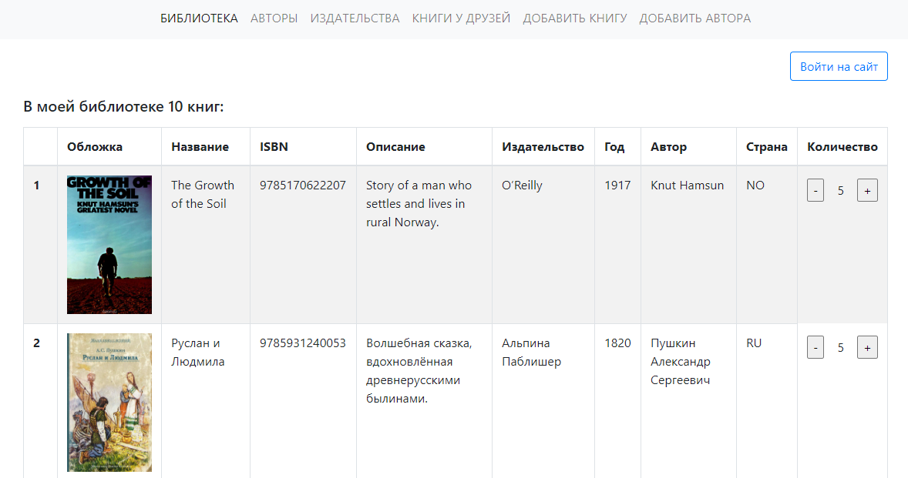

Приложение на **Django** для работы с базой книг (в проекте использую **SQLite**). Можно добавлять новые записи через интерфейс. Поддерживает авторизацию пользователей через GitHub. Фронтенд: **HTML** + **CSS** + **Bootstrap**.

[Посмотреть код](https://github.com/charlieplanka/skillfactory-D4-django-library)

