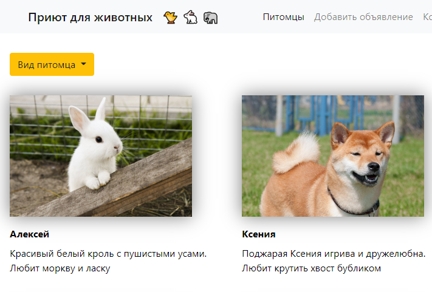

Страница вымышленного приюта для животных на **Django**. Есть фильтрация, добавление нового питомца, авторизация. Фронтенд: **HTML** + **CSS** + **Bootstrap**. В качестве БД использую **PostgreSQL**.

Проект развёрнут на [Heroku](https://still-falls-87338.herokuapp.com/)  
[Посмотреть код](https://github.com/charlieplanka/django-pet-shelter)

