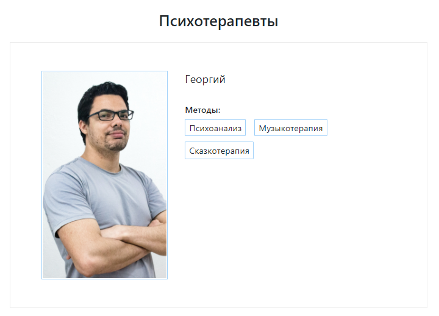

Страница со списком психотерапевтов на **Django**. Фронтенд: **HTML** + **CSS** + **Bootstrap**. В качестве БД использую **PostgreSQL**.

Данные в базе и на странице обновляются с помощью **management command**, которая синхронизирует базу с данными из внешней таблицы Airtable (через **API**).

[Посмотреть код](https://github.com/charlieplanka/psychotherapist-table)

