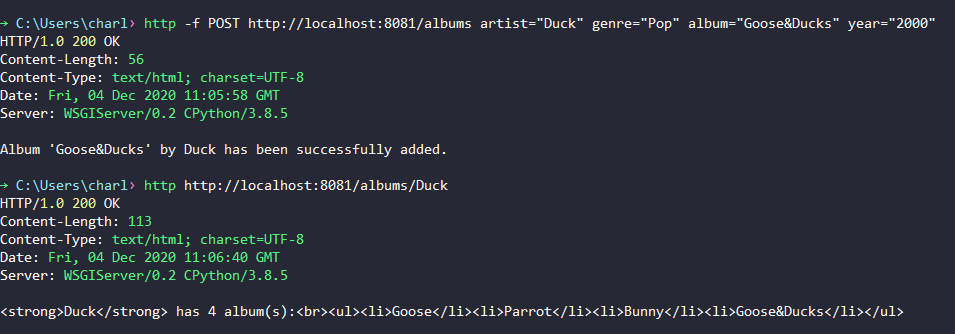

Мини-сервер на **Python** для работы с базой данных музыкальных альбомов. Использовала **SQLite** и библиотеку **SQLAlchemy**.

[Посмотреть код](https://github.com/charlieplanka/skillfactory-B6-music-albums)

