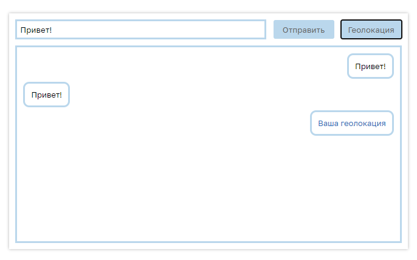

Чат на **JavaScript**, использующий **Websocket**-соединение. Сообщения отправляются на эхо-сервер, который просто возвращает сообщение обратно. Можно определить свою геолокацию.

Проект развёрнут на [GitHub Pages](https://charlieplanka.github.io/C6-websocket-chat/)   
[Посмотреть код](https://github.com/charlieplanka/C6-websocket-chat)

